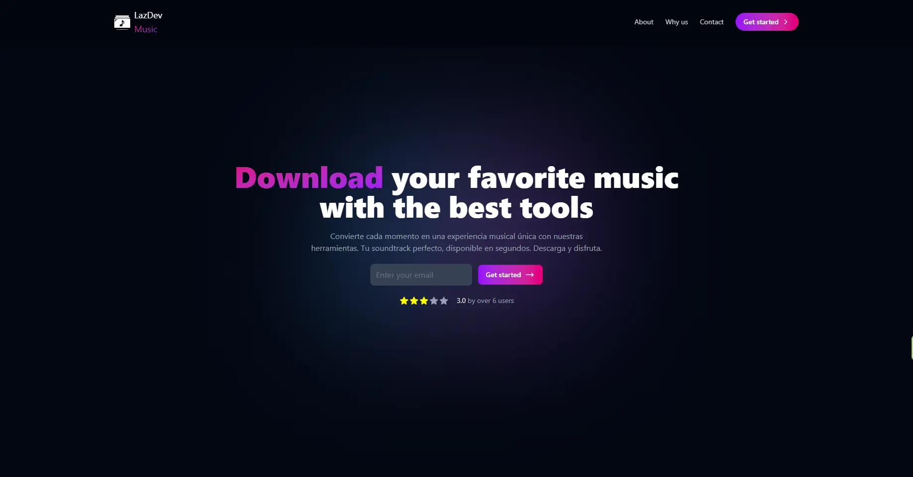

# Frontend

This is the frontend for the DownloadMusic project. It is a React application that provides the user interface for downloading music.

## 🖼️ Preview

  

## Features

- User-friendly interface for downloading music.
- Responsive design for mobile and desktop.

## Technologies

- React
- Vite
- JavaScript
- TailwindCSS

## Getting Started

1. Navigate to the `frontend` directory.
2. Install the dependencies with `npm install`.
3. Start the development server with `npm run dev`.

For more details on the project, see the [main README](../README.md).